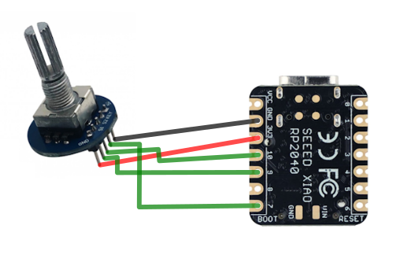

# Rotary encoder

A rotary encoder is a knob that sends a digital signal to our microcontroller if you turn it one way, and another signal if we turn it the other way. Perfect for our volume knob! You can press it as well, we'll use this to mute our microphone during meetings.

In this section we'll wire up the rotary encoder and program it.

## Wiring

To wire the rotary encoder follow this diagram (my apologies for the non-existing paint skills 😅)



We'll connect the rotary encoder using the shorter (10cm) wires with 2 female plugs on the end.

- [ ] `GND` to `GND` pin
- [ ] `5V` to the `3V3` pin on the board (❗❗ NOT THE `5V` PIN ❗❗)
- [ ] `S1` to `PIN 9`
- [ ] `S2` to `PIN 10`
- [ ] `KEY` to `PIN 7`

## Firmware

We'll use the built-in `rotary-encoder` library to read out our encoder. Follow [this tutorial](https://learn.adafruit.com/rotary-encoder/circuitpython) to get the rotary encoder running.

??? note "Completed code"
    ```py
    import rotaryio
    import board
    import digitalio
    import usb_hid
    from adafruit_hid.consumer_control import ConsumerControl
    from adafruit_hid.consumer_control_code import ConsumerControlCode

    button = digitalio.DigitalInOut(board.D12)
    button.direction = digitalio.Direction.INPUT
    button.pull = digitalio.Pull.UP

    encoder = rotaryio.IncrementalEncoder(board.D10, board.D9)

    cc = ConsumerControl(usb_hid.devices)

    button_state = None
    last_position = encoder.position

    while True:
        current_position = encoder.position
        position_change = current_position - last_position
        if position_change > 0:
            for _ in range(position_change):
                cc.send(ConsumerControlCode.VOLUME_INCREMENT)
            print(current_position)
        elif position_change < 0:
            for _ in range(-position_change):
                cc.send(ConsumerControlCode.VOLUME_DECREMENT)
            print(current_position)
        last_position = current_position
        if not button.value and button_state is None:
            button_state = "pressed"
        if button.value and button_state == "pressed":
            print("Button pressed.")
            cc.send(ConsumerControlCode.PLAY_PAUSE)
            button_state = None
    ```

**Next up** installing and programming our [keyboard switches](switches.md).
