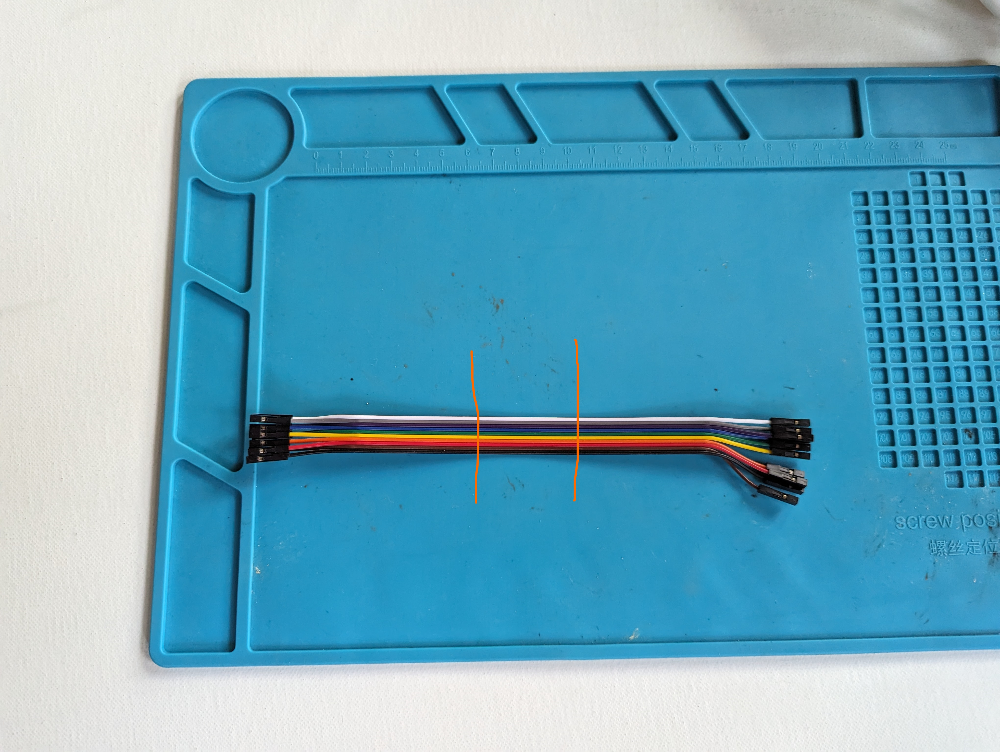
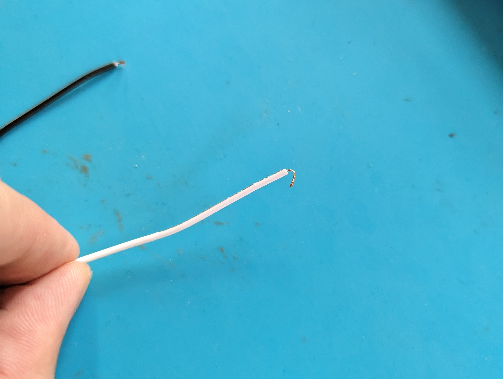
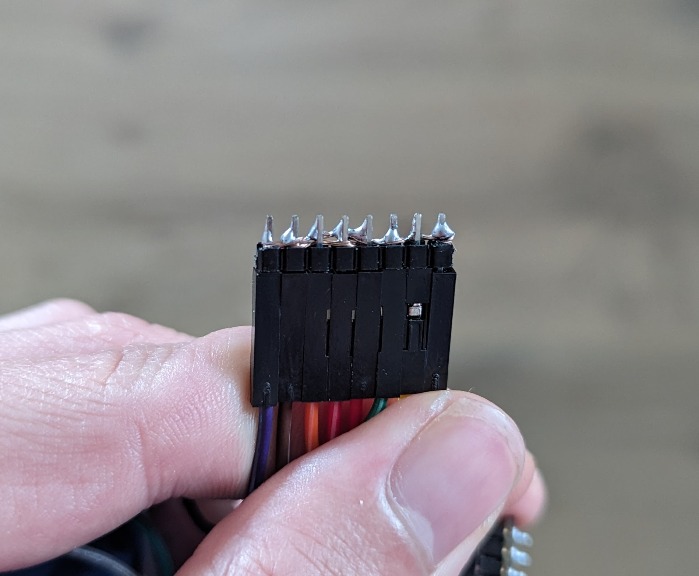
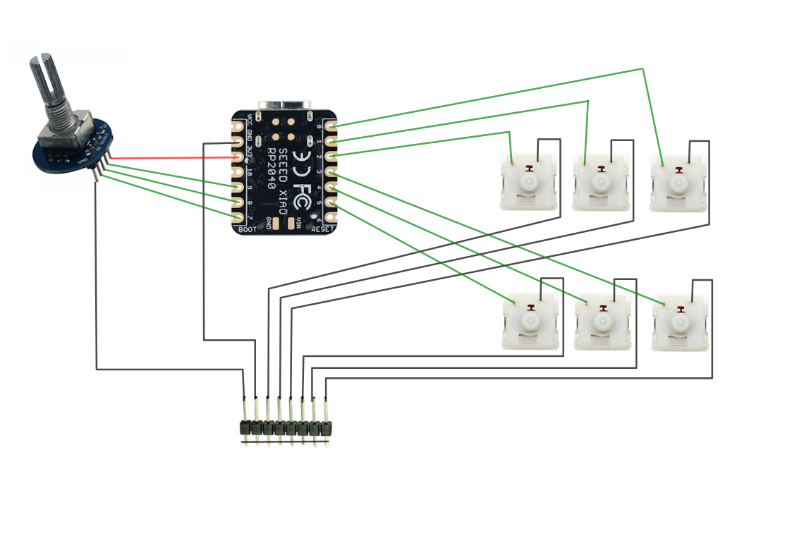

# The keyboard switches

Each macropad has 6 keyboard switches found in mechanical keyboards (you too can annoy your coworkers starting right now!). In this section we'll solder some wire to them, connect them to the board and make it act as a tiny keyboard.

## Soldering

Each one of these switches needs 2 wires soldered to them.

First we'll prepare the wires, grab 6 of the long jumper wires and cut them in 3 pieces.



Next we'll strip the wires, you should have 12 in total.
Now we'll solder the wires to our switches, this can be a bit tricky. I like to fold a small loop on the end of the stripped wire and then hook it over the pin of the switch and hold it in place with helping hands or tweezers.




Lastly we'll need to solder a common ground. Solder 8 header pins together by weaving a wire between the short side of the pins and then solder the wire to each pin.



## Wiring it up

Follow the wiring diagram to connect everything together. Every keyboard switch should have one pin going to the common ground (bottom of the image) and one pin to the microcontroller (pins 0 to 5).



## Firmware

To read all of our key inputs we'll be using the [keypad](https://docs.circuitpython.org/en/latest/shared-bindings/keypad/index.html) built-in library of CircuitPython.

Read [this tutorial](https://learn.adafruit.com/key-pad-matrix-scanning-in-circuitpython/overview) up to the second page, we'll base our code on [their example](https://learn.adafruit.com/key-pad-matrix-scanning-in-circuitpython/keys-one-key-per-pin#macropad-example-3099041). Our keys are set up a bit differently though, so I'll help you with the setup code:

```py
KEY_PINS = (
    board.D1,
    board.D2,
    board.D3,
    board.D4,
    board.D5,
    board.D6,
    board.D7 # Rotary encoder click
)

KEYCODES = (
    Keycode.ONE,
    Keycode.TWO,
    Keycode.THREE,
    Keycode.FOUR,
    Keycode.FIVE,
    Keycode.SIX,
    Keycode.SEVEN
)
```

The built in neopixel is a bit different as well, we only have the one.

```py
neopixel = neopixel.NeoPixel(board.NEOPIXEL, 1, brightness=0.4)
neopixel.fill(OFF_COLOR)
```

And instead of lighting up a specific NeoPixel, we'll always light up our single one. Replace `neopixels[key_number] = ON_COLOR` with `neopixel.fill(ON_COLOR)`.

If everything works out, you should have a tiny keyboard that sends the keys from 1 to 6, and the built in LED changes colour when a key is pressed.

??? note "Completed code"
    ```py
    import rotaryio
    import board
    import keypad
    import neopixel
    import usb_hid
    from adafruit_hid.keyboard import Keyboard
    from adafruit_hid.keycode import Keycode
    from adafruit_hid.consumer_control import ConsumerControl
    from adafruit_hid.consumer_control_code import ConsumerControlCode

    encoder = rotaryio.IncrementalEncoder(board.D9, board.D10)

    cc = ConsumerControl(usb_hid.devices)

    button_state = None
    last_position = encoder.position

    KEY_PINS = (
        board.D1,
        board.D2,
        board.D3,
        board.D4,
        board.D5,
        board.D6,
        board.D7 # Rotary encoder click
    )

    KEYCODES = (
        Keycode.ONE,
        Keycode.TWO,
        Keycode.THREE,
        Keycode.FOUR,
        Keycode.FIVE,
        Keycode.SIX,
        Keycode.SEVEN
    )

    ON_COLOR = (0, 0, 255)
    OFF_COLOR = (0, 20, 0)

    keys = keypad.Keys(KEY_PINS, value_when_pressed=False, pull=True)
    neopixel = neopixel.NeoPixel(board.NEOPIXEL, 1, brightness=0.4)
    neopixel.fill(OFF_COLOR)
    kbd = Keyboard(usb_hid.devices)

    while True:
        event = keys.events.get()
        if event:
            key_number = event.key_number
            # A key transition occurred.
            if event.pressed:
                kbd.press(KEYCODES[key_number])
                neopixel.fill(ON_COLOR)

            if event.released:
                kbd.release(KEYCODES[key_number])
                neopixel.fill(OFF_COLOR)

        current_position = encoder.position
        position_change = current_position - last_position
        if position_change > 0:
            for _ in range(position_change):
                cc.send(ConsumerControlCode.VOLUME_INCREMENT)
        elif position_change < 0:
            for _ in range(-position_change):
                cc.send(ConsumerControlCode.VOLUME_DECREMENT)
        last_position = current_position

    ```

**Next up** [assembly](assembly.md)!
